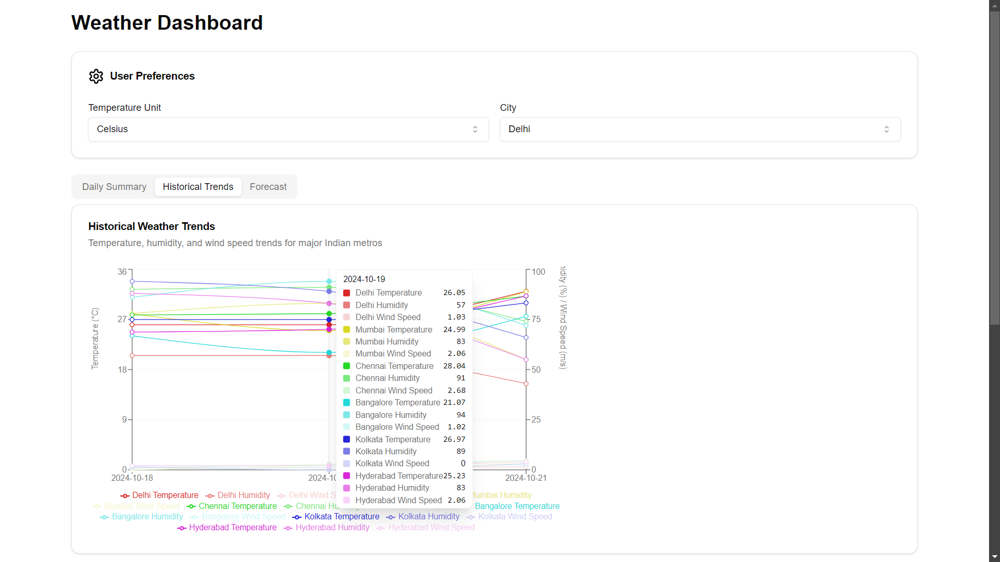
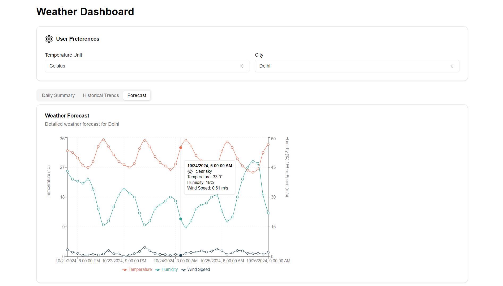

# Weather Dashboard Application

## Overview

This repository consists of two main parts:

1. **Backend (Flask API)**: A Python-based backend that provides weather data and alerts through API endpoints.
2. **Frontend (Next.js)**: A frontend application built with Next.js that displays the weather data and trends visually through charts and graphs.

## Prerequisites

- **Python 3.x** installed for the backend.
- **Node.js** and **npm** installed for the frontend (my-next-app).
- Make sure **no other Next.js applications** are running on port 3000.

## Project Structure

- `backend/`: Contains the Flask API and the Python code for the backend services.
- `my-next-app/`: Contains the Next.js application for the frontend UI.
- `backend/test/tests_app.py`: Contains unit tests for the Flask API.

## Setting Up and Running the Backend

The backend is a Flask server that provides weather data through API endpoints.

### Installation Steps

1. Clone the repository:
   ```bash
   git clone https://github.com/lathifshaik/Weather-Trends-Dashboard.git
   cd Weather-Trends-Dashboard
   ```

### Backend Setup Steps

1. **Navigate to the backend folder:**

   ```bash
   cd backend
   ```

2. **Install the required Python packages:**

   First, ensure that you have pip installed, and then install the dependencies listed in the requirements.txt file:

   ```bash
   pip install -r requirements.txt
   ```

3. **Run the Flask server:**

   Start the backend server by running:

   ```bash
   python app.py
   ```

   The Flask server will start and listen for requests at http://localhost:5000/api.

### Frontend Setup Steps

1. Open a new terminal and navigate to the my-next-app directory:

   ```bash
   cd my-next-app
   ```

2. Install frontend dependencies:

   Run the following command to install the required packages listed in package.json:

   ```bash
   npm install
   ```

3. Build the frontend application:

   Once the dependencies are installed, build the frontend:

   ```bash
   npm run build
   ```

4. Start the development server:

   Start the Next.js development server:

   ```bash
   npm run dev
   ```

5. Access the frontend dashboard:

   Open your browser and go to http://localhost:3000. Ensure no other applications are running on port 3000 to avoid conflicts.
### Key Backend Features

- **Imports**: The backend uses several core packages including Flask, flask_cors (for handling cross-origin requests from the frontend), and requests for API calls.
- **Endpoints**:
  - `/api/weather/current`: Fetches the current weather data.
  - `/api/weather/historical`: Provides historical weather trends for various cities.
  - `/api/weather/alerts`: Displays weather alerts.
- **Error Handling**: If any data fetching fails, the API provides meaningful error messages to the client.

### Unit Tests for Flask APIs

The backend includes unit tests to ensure the correctness of the API endpoints.

#### Running Unit Tests

1. Navigate to the test directory:

   ```bash
   cd backend/test
   ```

2. Run the unit tests:

   The tests are located in tests_app.py and can be run using Python's unittest module:

   ```bash
   python -m unittest tests_app.py
   ```

#### Test Coverage

- The tests check for correct API responses from the following endpoints:
  - `/api/weather/current`
  - `/api/weather/historical`
  - `/api/weather/alerts`
- They verify the correctness of data returned, the structure of JSON responses, and that errors are handled gracefully.

## Setting Up and Running the Frontend (Next.js)

The frontend is a React-based application built with Next.js.


## Application Features

- **Real-Time Weather Dashboard**: The frontend consumes data from the backend Flask API, displaying current weather conditions, historical weather trends, and triggered alerts for major cities.
- **Chart Visualizations**: Using recharts to display weather metrics such as average, maximum, and minimum temperatures, as well as humidity and wind speed.
- **Responsive Design**: The application is designed to be fully responsive across different screen sizes.
- **Data Refresh**: The data refreshes every 5 minutes to ensure the displayed information is always up to date.

## API Documentation

- `/api/weather/current`
  - Method: GET
  - Description: Fetches current weather data for the listed cities.
- `/api/weather/historical`
  - Method: GET
  - Description: Provides historical weather trends for the last few days for the listed cities.
- `/api/weather/alerts`
  - Method: GET
  - Description: Retrieves any active weather alerts for the cities.

## Screenshots






## Troubleshooting

- **Port Conflicts**: Ensure no other applications are running on ports 3000 (frontend) and 5000 (backend).
- **CORS Issues**: The backend uses flask_cors to handle cross-origin requests. Ensure both applications are running on localhost.
